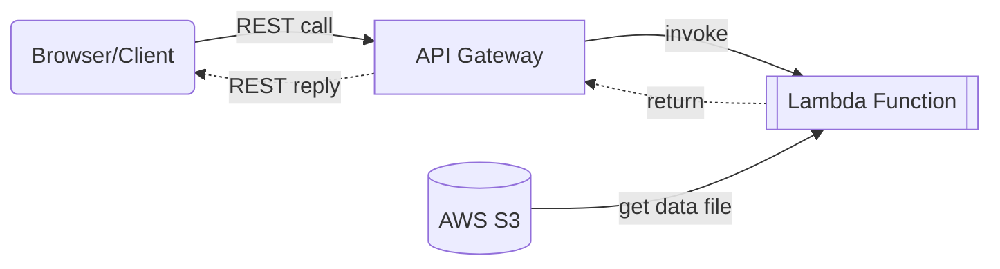
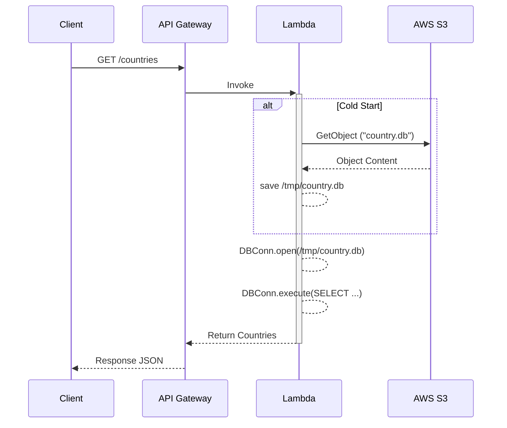
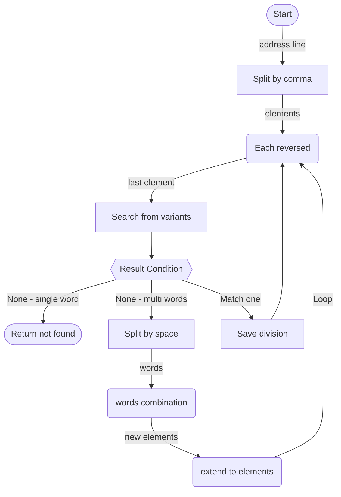

# Address Code - Ứng dụng ServerLess kiểu CQRS

## Mô tả giải pháp

### Yêu cầu chức năng

Ứng dụng Address Code nhỏ này được sử dụng để cung cấp tiện ích lựa chọn mã địa chỉ theo 4 cấp (theo tên tiếng Việt): quốc gia, tỉnh/thành phố, quận/huyện và phường/xã. Ứng dụng thực tế được lấy 1 phần nhỏ cách triển từ một dự án đã hoạt động mà tôi (Thạch Anh) đã làm. Do nhu cầu tạo các trang nhập liệu địa chỉ (trường trú, nguyên quán, giao hàng...) và khi ghi vào cơ sở dữ liệu, thường được tổ chức lưu từ 2 đến 4 cấp mã như trên. Tiện ích này cung cấp danh sách để lựa chọn phù hợp cho kiểu ứng dụng Front-End SPA (Rich). API được expose có thể dùng cross-site.

Tính năng liệt kê như sau:

1. Cung cấp lựa chọn 4 phân cấp: country, division (province level), sub division (district level), level 2 sub division (commune level).
2. Sử dụng mã tiêu chuẩn: 2 cấp country và division là ISO 3166-2, 2 cấp dưới là tuỳ theo guốc gia, với Việt Nam là mã của Tổng cục thống kê (3 số cho cấp quận/huyện/thị xã và 5 số cho cấp phường/xã/thị trấn).
3. Cho phép lựa chọn linh hoạt, ở cấp 3 (sub division) hay cấp 4 (level 2 sub division) chỉ cần chỉ định mã quốc gia + mã đơn vị đó là xác định các cấp trên đó.
4. Dự định tương lai: thêm tiện ích nhập 1 dòng địa chỉ, thì phân tách thành 3-4 cấp nhiều nhất có thể của địa chỉ.

### Ý tưởng Kiến trúc - phi chức năng

Đây là ứng dụng phát triển trên 1 kiến trúc cải biên mới, xuất phát từ ý tưởng tóm tắt như sau:

1. Ứng dụng nền ServerLess, ở đây là các AWS Lambda Function, có thể viết bằng Python (cold start tốt) hay Java (cần có snap start).
2. Cơ sở dữ liệu là dạng local file, chạy trực tiếp như SQLite, H2, Derby… không chia sẻ và chỉ 1 thread sử dụng (hoặc nếu có đa luồng thì một số hữu hạn).
3. Ứng dụng có một phần riêng biệt chính, phần này đảm nhiệm xử lý các hành động đọc của ứng dụng (reader thread). Phần ghi sẽ tách riêng và triển khai kiểu mẫu kiến trúc CQRS hay Event Sourcing.
4. Khi cold start, các function sẽ tải data file từ AWS S3 xuống - quá trình này cực kỳ nhanh và chi phí thấp. Sau đó ứng dụng sẽ dùng trực tiếp CSDL này chạy các chức năng phục vụ request. Warm start sẽ không cần tải lại file, mà sử dụng luôn. AWS Lambda mặc định giữ ứng dụng ngủ 5 phút chờ cho request kế tiếp.
5. Các hành động có tác động cập nhật DB, sẽ thực hiện bởi 1 luồng riêng, được trigger qua SNS/SQS hoặc Kafka (nếu lớn). Luồng này cũng sẽ tải data file tử S3 xuống, rồi xử lý, cập nhật (theo 1 bó - batch oriented), sau đó PUT data file trở lại S3 cho các reader thread sử dụng (nếu chúng cold start).

Các tính chất, ưu điểm và lưu ý:

1. Kiểu triển khai phù hợp cho ứng dụng thường xuyên chỉ đọc, ít ghi. Nếu phải ghi thì ở luồng riêng biệt (CQRS) và cũng không cần hiện lên tức thời cho mọi độc giả.
2. Đặc điểm thiết kế thì dữ liệu ứng dụng phải là eventually consistent, ứng dụng có tính phân tán tức là không có centralized database và không cần áp đặt concurrency control.
3. Ưu: Tiết kiệm chi phí ở mức sử dụng ít, nhưng lại cho phép scale out lớn (chi phí tăng gần tuyến tính). Do vậy áp dụng cho dịch vụ ít người sử dụng thì chi phí maintain rất thấp (do ServerLess tất cả và chỉ bị tính tiền storage lưu)
4. Lưu ý: data file cần có kích thước nhỏ, dưới 512MB là ít tốn tiền nhất và lại nhanh. Nhiều hơn thì lên đến 5GB là phù hợp (cân bằng thời gian tải xuống khi khởi động). Có thể nén data file dạng chỉ đọc và giảm dung lượng.

## Cấu trúc tổng thể

Ứng dụng Address Code là tiện ích có 4 thành phần tham gia và liên kết giữa chúng như sau:

## Sequence diagram

Trong đó:

1. AWS Lambda Function: phải có vùng lưu tạm /tmp (ephemerral storage). Kích thước mặc định và miễn phí là 512MB.
2. Tại quá trình Cold Start, thì data file sẽ được tải từ AWS S3 về.
3. Phần handler xử lý chính sẽ mở db file và thực hiện truy vấn, trả dữ liệu về như các ứng dụng bình thường.

## Tính năng phân tích địa chỉ

Ngoài việc liệt kê, lựa chọn địa chỉ, thì Address Code bổ sung tính năng phân tích từ 1 dòng địa chỉ thành mã tỉnh/thành phô, quận/huyện, phường/xã...

Ví dụ như sau:

1. "Số 18/564/55/14\nNguyễn Văn Cừ, Gia Thụy, Long Biên, Hà Nội" thành VNM, 01 (Hà Nội), 004 (Long Biên), 

Thiết kế lưu đồ sau đây là giải thuậti (áp dụng tìm kiếm cho 1 thành tố division):

Trong đó:

1. Split by comma: Tách dòng thành các đoạn cách nhau bởi dấu phảy hoặc dấu trừ.
2. Search from variants: các đoạn - ngoài bản gốc - được ghép thêm chuỗi đầu ngữ như "Tỉnh", "Thành Phố", "TP." ... thành variants, để tìm kiếm tên trong CSDL.
3. Split by space & words combination: nếu đoạn không tìm thấy và đoạn có nhiều từ (cách nhau bởi space/dấu xuống dòng) thì sẽ tách thành các từ, rồi trích 1 số từ, ghép nhiều từ lại và thêm đầu ngữ thành các variants, rồi tìm kiếm tương tự. Hành động này nhằm tìm kiếm thêm các tình huống không phân tách bởi dấu phảy, ví dụ viết "Long Biên\nHà Nội" thì vẫn tìm đúng.
4. Save division và Return not found: là 2 điểm trả kết quả về, giả định thủ tục này chạy cho division.
